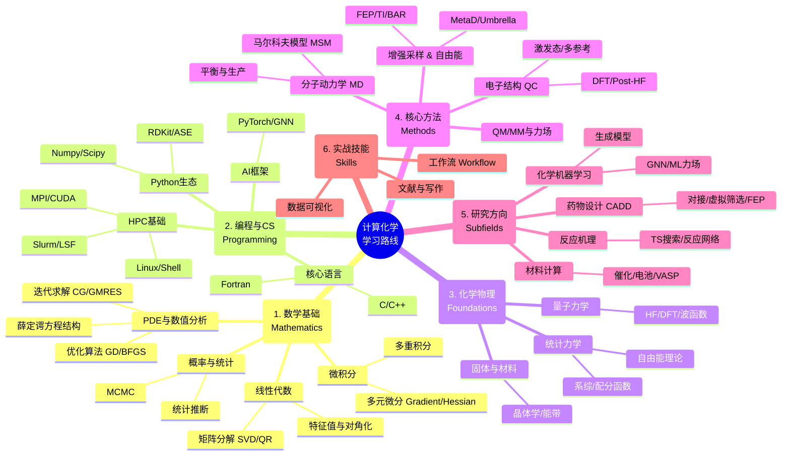

# Roadmap

这里提供了计算化学的系统学习路线图，帮助大家按按照学科和方向（如药物设计、材料计算、量子化学等）逐步构建知识体系。

## Computational Chemistry Roadmap (Mindmap)

<b>📐 1. 数学基础 (Mathematics for Computational Chemistry)</b>

 

* **线性代数（核心）**
    * 特征值问题、对角化、正交化
    * 矩阵分解（SVD, QR）
* **微积分**
    * 多元微分（梯度、Hessian）
    * 多重积分（统计力学核心）
* **概率论与统计**
    * 分布、采样、统计推断
    * MCMC 与统计加速
* **偏微分方程 PDE**
    * 薛定谔方程的数学结构
* **数值分析**
    * 数值优化（GD / BFGS / L-BFGS）
    * 数值积分
    * 线性系统的迭代求解（CG / GMRES）
    * 稳定性分析
* **其他数学工具**
    * 群论（对称性分析）
    * 图论（分子图、GNN 基础）

<b>💻 2. 编程与计算机科学 (Programming & CS Foundations)</b>

 

* **Python（科研主语言）**
    * `numpy` / `scipy` / `matplotlib`
    * `RDKit`（SMILES、分子指纹）
    * `ASE` / `MDAnalysis`
    * `PyMol` / `VMD` Python API
* **核心语言**
    * C/C++（高性能计）
    * Fortran（量化软件核心语言）
* **Shell / Bash 脚本**
* **环境管理**
    * conda / mamba / YAML
* **HPC（高性能计算）**
    * Slurm / LSF 作业管理
    * GPU/CUDA、MPI 多节点并行
    * 大规模任务（job arrays / 自动重启）
* **机器学习框架**
    * PyTorch / TensorFlow
    * PyTorch Geometric / DGL（GNN）

<b>⚛️ 3. 化学与物理基础 (Chemistry + Physics Foundations)</b>

 

* **量子力学（必修）**
    * 波函数、算符、变分原理
    * Hartree-Fock 近似
    * DFT：泛函、基组、收敛问题
* **统计力学**
    * 各类系综（NVT/NPT/μVT）
    * 配分函数 → 热力学量
    * 自由能理论（FE）
* **热力学基础**
* **晶体学 & 固体物理**
* **分子光谱学**

<b>⚙️ 4. 核心计算方法 (Core Computational Methods)</b>

 

* **4.1 电子结构计算 (Quantum Chemistry)**
    * HF / MP2 / CI / CCSD(T)
    * DFT（GGA / Hybrid / Meta-GGA）
    * 激发态（TD-DFT、EOM-CC）
    * 多参考方法（CASSCF/MRCI）
    * 线性标度方法（RI、DLPNO）
    * TS 搜索 / IRC / PES
* **4.2 分子力学与力场 (MM & FF)**
    * AMBER / CHARMM / OPLS / GAFF
    * 力场参数化（charge fitting）
    * 扭转扫描（torsion scan）
* **4.3 分子动力学 (MD Simulation)**
    * 能量最小化 → 平衡 → 生产
    * 温控 / 压控 / PME 长程作用
    * 分析：RMSD/RMSF/H-bond/ASA
    * MSM 马尔科夫状态模型
    * coarse-grained (粗粒化) 模型
    * 常用软件：AMBER / GROMACS / OpenMM
* **4.4 增强采样 (Enhanced Sampling)**
    * Metadynamics / Umbrella Sampling
    * ABF / aMD / GaMD
    * Replica Exchange / REUS
* **4.5 自由能计算 (Free Energy Methods)**
    * FEP / BAR / MBAR
    * TI（Thermodynamic Integration）
    * WHAM / PMF / CV 设计
* **4.6 QM/MM 混合计算**

<b>🔬 5. 研究分支方向 (Subfields / Specializations)</b>

 

* **5.1 计算药物设计 (CADD & AIDD)**
    * 分子对接（Vina/Smina/Glide）
    * 虚拟筛选（VS）
    * ADMET / 多参数优化
    * 蛋白—配体结合能预测
    * AI 配体生成（DiffDock / RFDiffusion）
* **5.2 材料计算 (Computational Materials)**
    * VASP / QE / CP2K
    * 能带、DOS、声子色散
    * 缺陷、界面、二维材料
    * 电池、半导体、催化
* **5.3 化学机器学习 (ML for Chemistry)**
    * 分子表示（SMILES/Graph/3D）
    * QSAR/QSPR、指纹、描述符
    * 图神经网络（GNN）
    * ML 力场（ANI / NequIP / DeepMD）
    * 生成式模型（VAE/GPT/DM）
* **5.4 催化计算 (Catalysis)**
    * 表面吸附 / d-band 理论
    * NEB 反应路径
    * microkinetic 建模
* **5.5 电化学计算 (Electrochemistry)**
    * 固液界面
    * SHE / RHE 电位校准
    * 电催化 / 电池材料
* **5.6 反应网络探索 (Automatic Reaction Exploration)**
    * autodE
    * PES 自动扫描
    * 机理自动化预测

<b>🛠️ 6. 实战能力 (Practical & Technical Skills)</b>

 

* **HPC 高阶技巧**
    * 监控 / 调错 / 扩展
* **Workflow 构建**
    * Snakemake / Nextflow
* **环境 & 包管理**
    * conda / mamba
* **分析脚本**
    * MDAnalysis / PyMol API / VMD TCL
* **数据可视化**
    * Nature 风格绘图
* **大规模数据结构管理**
    * MD 轨迹 / QC 输出

<b>📝 7. 科研技能 (Research Skills)</b>

 

* **文献精读方法**（化学方法论）
* **科研写作**（JACS / Nat Chem 结构）
* **图示设计**（TOC、Scheme、图表）
* **项目设计**（idea → code → validation → paper）
* **可重复性**（Reproducibility Standards）

## Summary of Computational Chemistry Method and Application

<!-- Styled figure: responsive width, rounded corners, subtle shadow, and softer caption -->

  
A high-level overview of methods and applications in computational chemistry / 计算化学方法与应用概览

  <figure style="display:inline-block; margin:0;">
    
    <figcaption style="text-align:center; color:#666; font-size:0.92rem; margin-top:0.5rem;">
      <strong>Figure.</strong> Computational chemistry methods and applications — 计算化学方法与应用
    </figcaption>
  </figure>

